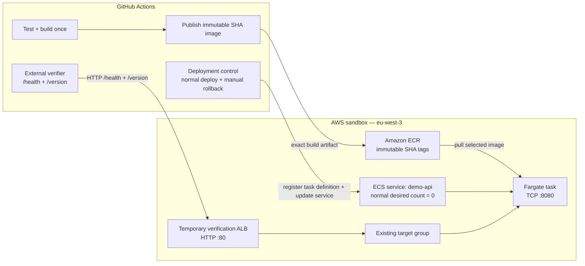

# Sprint 01 — Architecture

## Purpose

This document describes the final Sprint 01 deployment, verification, rollback, and cleanup architecture.

## Architecture diagram

## Design notes

GitHub OIDC is an authentication mechanism for the AWS-facing jobs, not an artifact-processing stage in the diagram. The publishing and deployment jobs each obtain temporary AWS credentials before calling AWS APIs.

Terraform owns only the temporary verification ALB and listener. The ECS service, target group, security groups, subnets, and other retained development resources already exist outside that Terraform state.

The normal runtime baseline is:

- ECS service desired count `0`
- no temporary verification ALB

During deployment or rollback, the service is temporarily scaled to `1`, verified externally through the ALB, then returned to desired count `0` and the temporary ALB is destroyed.

Rollback selects an already-published immutable ECR image by full Git SHA. It does not rebuild an old commit.
