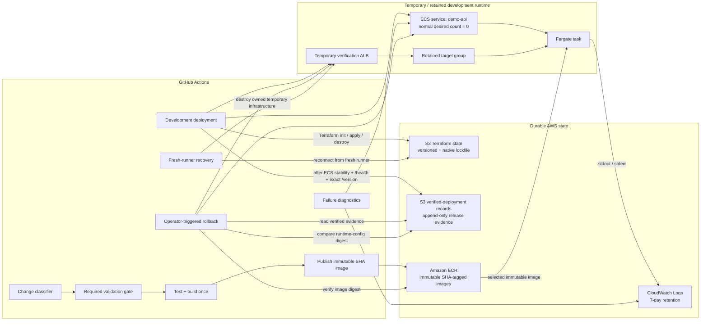

# Sprint 02 — Architecture

## Purpose

This document describes the final Sprint 02 architecture for recoverable, observable, cost-controlled development deployments.

Sprint 02 extends the Sprint 01 deployment path with:

- durable remote Terraform state;
- native S3 state locking;
- fresh-runner cleanup recovery;
- bounded CloudWatch application logs;
- correlated deployment diagnostics;
- durable verified-deployment records;
- machine-verifiable rollback eligibility;
- runtime-configuration compatibility checks;
- conservative change-aware CI.

The environment remains development-only and does not claim production readiness.

## Architecture diagram



## Design notes

GitHub Actions uses OIDC for temporary AWS credentials. No long-lived AWS access keys are required by the deployment workflows.

Terraform owns only the temporary verification-lifecycle infrastructure. The ECS cluster, ECS service, target group, networking, ECR repository, log group, Terraform backend, and deployment-record storage are retained resources outside that temporary Terraform state.

The authoritative Terraform state for development verification is stored in versioned Amazon S3. Native S3 lockfiles protect Terraform state mutation independently of GitHub workflow concurrency.

A fresh runner can reconnect to the same remote state after the original execution disappears. Cleanup therefore does not depend on retaining the original runner filesystem.

Application stdout and stderr are retained in CloudWatch Logs for 7 days. Diagnostics correlate ECS service state, stopped-task details, container exit information, task-definition identity, image identity, verifier results, and application logs.

Successful deployment evidence is written only after:

```text
ECS service stable
+
external /health succeeds
+
external /version exactly matches the intended Git SHA
```

Verified deployment records are retained as durable machine-readable release evidence.

Rollback remains an explicit operator action. Current rollback eligibility requires:

```text
target environment
+
immutable image identity
+
schema-v2 verified deployment record
+
matching image digest
+
matching runtime_config_digest
+
historical successful health/version evidence
```

The rollback workflow does not restore a historical ECS task definition. It registers a fresh revision using the selected historical image and the current task-definition configuration only when the historical and current runtime-configuration digests match.

The runtime configuration digest covers the ECS task-definition registration document except for the application image itself. It does not prove compatibility for mutable external state such as:

* secret values behind unchanged references;
* database contents or schema;
* external API contracts;
* mutable dependencies outside the task-definition document.

The normal resting baseline is:

```text
ECS desired = 0
ECS running = 0
ECS pending = 0
temporary verification ALB = absent
temporary Terraform managed resources = none
```

The retained target group is intentional baseline infrastructure and is not owned by the temporary verification Terraform state.

ECR images use immutable full-SHA tags. Sprint 02 does not apply a blind age- or count-based ECR lifecycle rule because native ECR lifecycle rules cannot determine whether an image is still required by retained verified-deployment evidence. Image cleanup must therefore protect the current ECS image and images required by retained rollback evidence before deletion is considered.

CloudWatch log retention is explicitly bounded to 7 days. Terraform state and verified-deployment records remain versioned durable S3 objects whose storage footprint is negligible at the current project scale.

Change-aware CI skips only paths proven not to affect the deployable system. Unknown paths fall back to conservative validation, and the stable `CI required` gate remains the branch-protection contract.

Sprint 02 therefore separates four concerns:

```text
artifact identity
runtime configuration identity
durable recovery/evidence
temporary deployment runtime
```

Historical verification establishes rollback eligibility under the tested Sprint 02 model. It does not replace fresh post-rollback stabilization and external verification.
